<div align="center">

```
 ██████╗ ███╗   ███╗███╗   ██╗██╗
██╔═══██╗████╗ ████║████╗  ██║██║
██║   ██║██╔████╔██║██╔██╗ ██║██║
██║   ██║██║╚██╔╝██║██║╚██╗██║██║
╚██████╔╝██║ ╚═╝ ██║██║ ╚████║██║
 ╚═════╝ ╚═╝     ╚═╝╚═╝  ╚═══╝╚═╝
```

**One binary. One dashboard. Full-stack power.**

[](https://www.rust-lang.org/)
[](https://www.typescriptlang.org/)
[](LICENSE)
[](#)
[](.github/workflows/security.yml)
[](#)

*File ops · Full-text search · Format conversion · Archive management · Dev toolkit · Live web dashboard*

</div>

---

## What is OmniCLI?

OmniCLI is a **professional-grade, full-stack command-line toolkit** that replaces a scattered collection of utilities with a single, coherent binary — backed by a live React web dashboard and a typed REST API. Whether you're managing files on Android via Termux, doing security research on Kali Linux, writing automation scripts on ParrotOS, or running the live dashboard on Replit — `omni` speaks one grammar across every platform.

```bash
# Find every Rust file modified in the last 7 days
omni file find "*.rs" --modified 7d

# Hash a binary with BLAKE3 and pipe it
omni file hash firmware.bin --json | jq .digest

# Search millions of indexed files for a CVE in under a second
omni search "CVE-2026-1234"

# Convert an entire CSV dataset to JSON
omni convert run data.csv data.json

# Pack a directory into a compressed archive
omni archive create release.tar.gz ./dist

# Encrypt a file with age X25519
omni file encrypt secrets.toml --recipient age1ql3z7hjy54pw3hjymouwyfx24i98aw2aqx77k5

# Open the dashboard (Replit / local)
open http://localhost:$PORT
```

---

## Project Components

| Component | Technology | Purpose |
|-----------|------------|---------|
| **Rust CLI** (`omni`) | Rust 1.88 · clap 4 · SQLite FTS5 | Core binary — all commands, all modules |
| **REST API** | Node.js · Express · TypeScript · Zod | Bridges CLI modules with the web layer |
| **Web Dashboard** | React 19 · Vite · Tailwind CSS 4 | Live telemetry, search, converter, dev toolkit |
| **Shared DB** | Drizzle ORM · SQLite | Notes, todos, snippets, activity log, backups |
| **OpenAPI Spec** | Orval · Zod · React Query | End-to-end typed client/server contract |

---

## CLI Modules

| Module | Commands | Highlights |
|--------|----------|------------|
| **`omni file`** | find, copy, move, compare, duplicate, clean, hash, encrypt, decrypt, compress, sync | BLAKE3/SHA256/MD5 · age X25519 encryption · verified copy · BLAKE3-powered sync |
| **`omni search`** | index, query, rebuild | SQLite FTS5 · Porter stemmer · regex · per-type filters · sub-second queries |
| **`omni archive`** | create, extract, list, convert | zip · tar.gz · tar.xz · tar.bz2 · magic-byte detection · zip-slip protected |
| **`omni convert`** | run, list | 16 format pairs: CSV↔JSON · YAML↔TOML↔JSON · MD→HTML · PNG/JPG↔WebP · PDF→TXT |
| **`omni config`** | show, path | Full TOML config with live defaults |

## Web Dashboard Panels

| Panel | What it does |
|-------|-------------|
| **Command Center** | Real-time system telemetry — file counts, storage, module status, activity log |
| **Global Search** | Full-text search across indexed files via the REST API |
| **File Finder** | Browse the filesystem and inspect file metadata |
| **Archive Inspector** | List and inspect archive contents without extracting |
| **Format Converter** | Convert files between 16 format pairs via drag-and-drop |
| **Dev Toolkit** | Hash, Base64, UUID generation, regex tester, JSON formatter, JWT decoder |
| **Workspace** | Notes, todos, and snippets — persisted in SQLite |
| **Backup Ops** | Incremental backup tracking with BLAKE3 deduplication |

---

## Design Principles

| Principle | What it means |
|-----------|---------------|
| **Zero mock data** | Every function returns data from a real operation. Unimplemented paths return an explicit `Err` — never a fake `Ok`. |
| **Typed errors everywhere** | Each crate owns a `CrateError` enum via `thiserror`. `anyhow` lives only at the dispatch boundary. |
| **BLAKE3 by default** | All content-hash operations use BLAKE3. SHA256 and MD5 available via `--algo`. |
| **Zip-slip protected** | Archive extraction validates all entry paths against `..` traversal and absolute-path injection. |
| **`--json` on every command** | Every command emits machine-readable JSON — no screen-scraping required. |
| **`--dry-run` on destructive ops** | `clean`, `sync --delete-extraneous`, and `duplicate --delete-dupes` all support `--dry-run`. |
| **`NO_COLOR` respected** | Colour output honours the [no-color.org](https://no-color.org) standard and the `--no-color` flag. |

---


## Screenshots

Explore OmniCLI's capabilities through our full-stack interface.

### Web Dashboard

#### Light Theme Dashboard
<p align="center">
  
  <br>
  <em>Real-time system telemetry, file counts, storage stats, and module status in Light Mode.</em>
</p>

#### Command Center
<p align="center">
  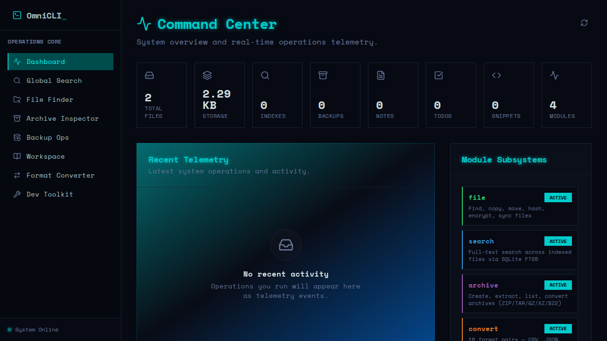
  <br>
  <em>Real-time system telemetry, file counts, storage stats, and module status in Dark Mode.</em>
</p>

#### Format Converter
<p align="center">
  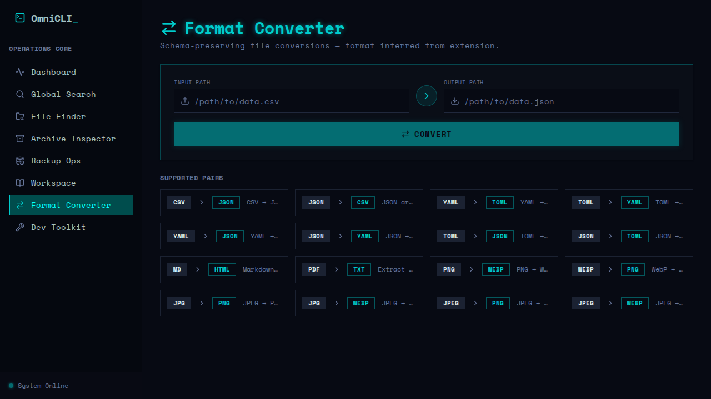
  <br>
  <em>Convert files between 16 formats via an intuitive drag-and-drop interface.</em>
</p>

### Core Features

#### File Operations
<p align="center">
  
  <br>
  <em>Browse the filesystem and inspect metadata effortlessly.</em>
</p>

#### Search & Find
<p align="center">
  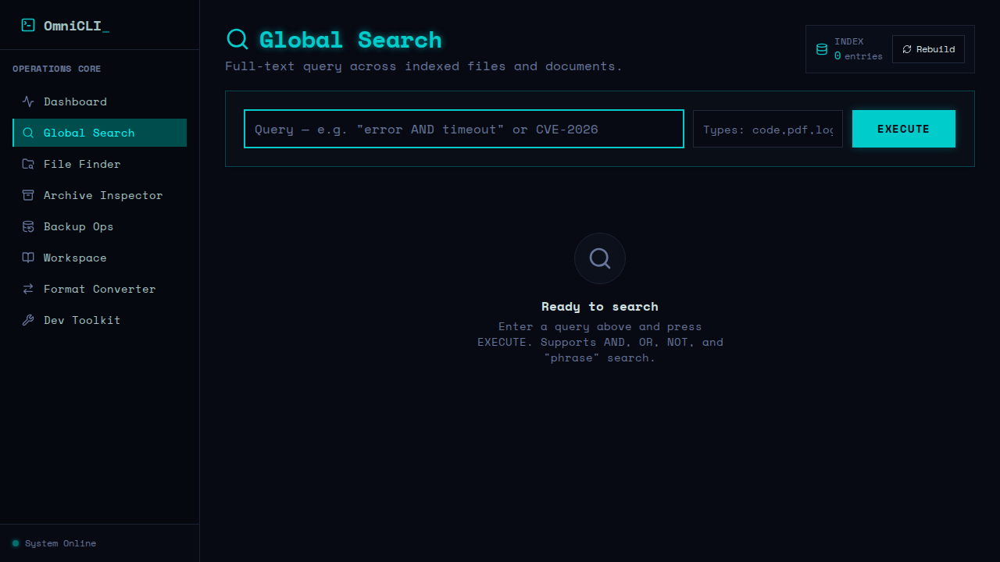
  <br>
  <em>Sub-second full-text queries across your indexed files using SQLite FTS5.</em>
</p>

#### Duplicate Finder
<p align="center">
  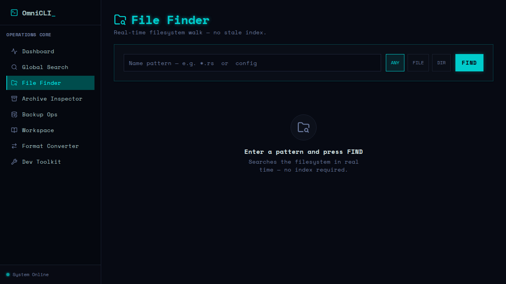
  <br>
  <em>Find and manage duplicate files quickly within the File Operations suite.</em>
</p>

#### Hash Generator
<p align="center">
  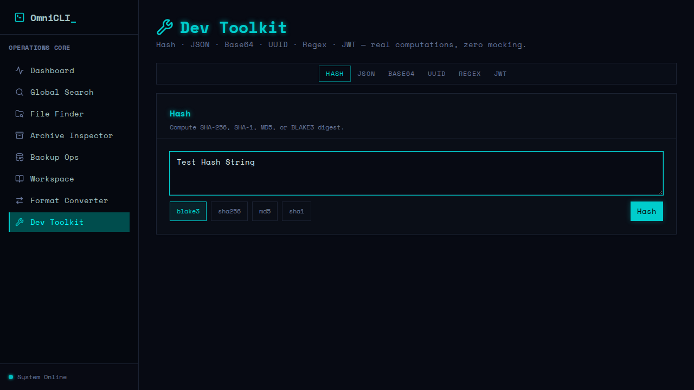
  <br>
  <em>Generate cryptographically secure hashes directly from the web dashboard.</em>
</p>

#### Compression & Encryption
<p align="center">
  
  <br>
  <em>Manage file compression and secure them with encryption via the dashboard.</em>
</p>

#### Sync & Backup
<p align="center">
  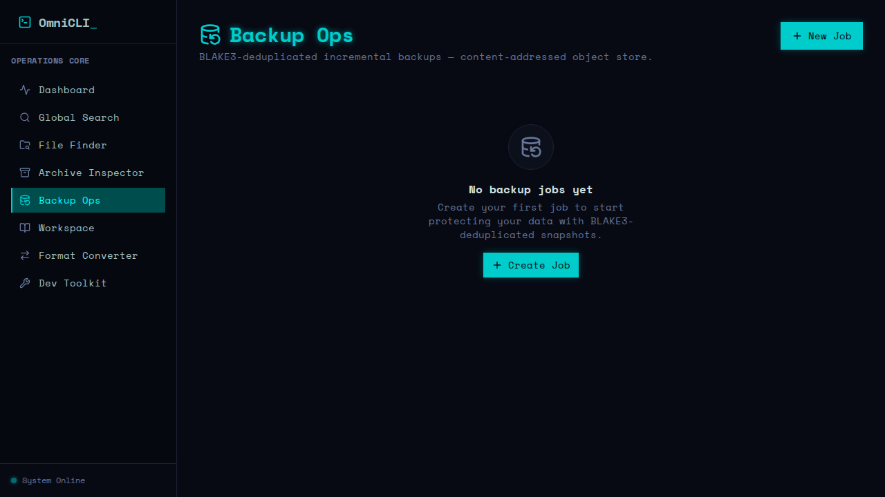
  <br>
  <em>Track incremental backups using BLAKE3 deduplication.</em>
</p>

#### Dev Toolkit
<p align="center">
  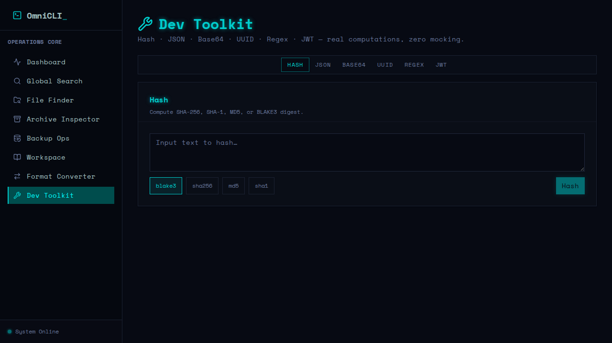
  <br>
  <em>Hash, Encode, UUID generation, regex testing, and JSON formatting.</em>
</p>

### Application Management

#### Settings & Workspace
<p align="center">
  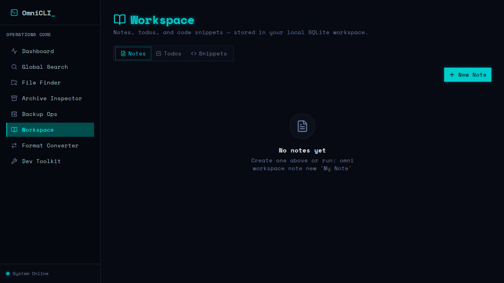
  <br>
  <em>Configure workspace features, notes, and manage application state.</em>
</p>

#### Help & About (Archive Inspector)
<p align="center">
  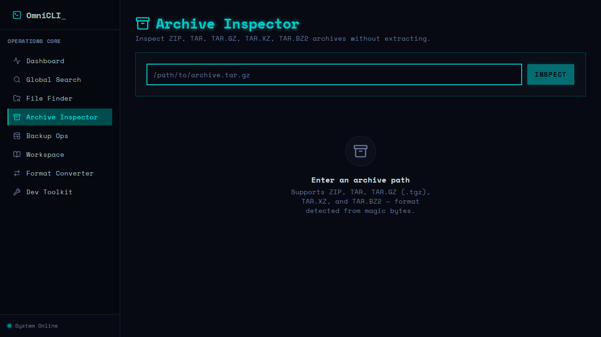
  <br>
  <em>Explore archive details and view in-depth information about your files.</em>
</p>

### CLI Experience

#### Terminal Commands
<p align="center">
  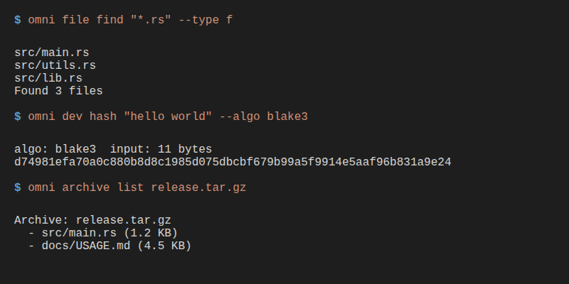
  <br>
  <em>Blazing fast file finding, hashing, and archive management.</em>
</p>
<p align="center">
  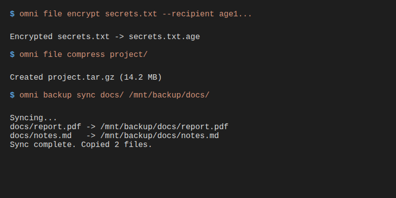
  <br>
  <em>Age X25519 encryption, compression, and syncing operations.</em>
</p>

### Mobile Experience

#### Responsive Command Center
<p align="center">
  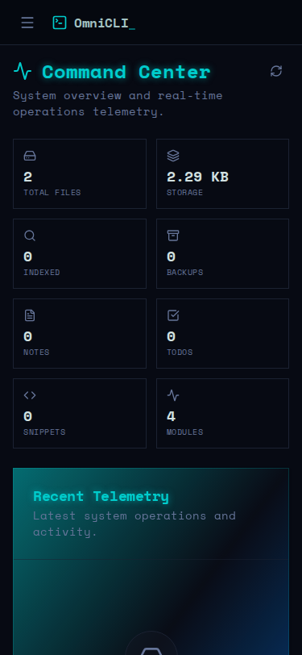
  <br>
  <em>Full-stack power accessible from your phone or Termux environment.</em>
</p>

---

## Installation

### Replit (zero setup)

All three services start automatically. After cloning:

```bash
pnpm install
pnpm --filter @workspace/db run push   # create SQLite tables (first run only)
# workflows start automatically — API on :8080, dashboard on the preview URL
```

Build the Rust CLI:

```bash
cd omnicli && cargo build --release
./target/release/omni --help
```

### Termux (Android)

```bash
pkg update && pkg install rust git
git clone https://github.com/Manash07Bhoi/OmniCLI
cd OmniCLI/omnicli && cargo build --release
cp target/release/omni $PREFIX/bin/
omni --version
```

### Kali Linux / ParrotOS / Debian

```bash
sudo apt install build-essential libssl-dev pkg-config
curl --proto '=https' --tlsv1.2 -sSf https://sh.rustup.rs | sh
source $HOME/.cargo/env

git clone https://github.com/Manash07Bhoi/OmniCLI
cd OmniCLI/omnicli && cargo build --release
sudo cp target/release/omni /usr/local/bin/
omni --version
```

### Build from source

```bash
cd omnicli

# Debug build (fast compile, full symbols)
cargo build

# Optimised release binary (~12 MB, statically linked SQLite)
cargo build --release

# Run all tests
cargo test

# Lint (must stay clean)
cargo clippy -- -D warnings
```

---

## Global Flags

Every `omni` command accepts these flags at any position:

| Flag | Short | Description |
|------|-------|-------------|
| `--json` | | Structured JSON output — no ANSI codes, pipe-friendly |
| `--no-color` | | Disable colour (also honours `NO_COLOR` env var) |
| `--quiet` | `-q` | Suppress non-error output |
| `--verbose` | `-v` | Show debug traces to stderr |
| `--dry-run` | | Show plan without executing (destructive ops only) |
| `--config <PATH>` | | Override `~/.config/omni/omni.toml` |

---

## Command Reference

See **[docs/USAGE.md](omnicli/docs/USAGE.md)** for the complete practical reference with real examples and expected output.

### Quick examples

```bash
# ── File ops ──────────────────────────────────────────────────────────────────
omni file find "*.rs" --modified 7d --type f
omni file hash firmware.bin --algo sha256 --json | jq .digest
omni file copy src/ dist/ --recursive --verify
omni file sync ~/source ~/backup --delete-extraneous --dry-run
omni file duplicate --scan ~/Downloads --delete-dupes --dry-run

# ── Search ────────────────────────────────────────────────────────────────────
omni search index ~/projects ~/Documents
omni search "CVE-2026-1234"
omni search query "TODO|FIXME" --in code --regex

# ── Archives ──────────────────────────────────────────────────────────────────
omni archive create release.tar.gz src/ docs/
omni archive extract release.tar.gz --to /tmp/release
omni archive list release.tar.gz --json | jq '.[].name'
omni archive convert project.zip project.tar.gz

# ── Conversion ────────────────────────────────────────────────────────────────
omni convert run data.csv data.json
omni convert run config.yaml config.toml
omni convert run photo.png photo.webp
omni convert list

# ── Encryption ────────────────────────────────────────────────────────────────
age-keygen -o key.txt
omni file encrypt report.pdf --recipient age1ql3z7...
omni file decrypt report.pdf.age --identity AGE-SECRET-KEY-1...

# ── Config ────────────────────────────────────────────────────────────────────
omni config show
omni config show --json | jq .search.index_paths
omni config path
```

---

## API Server

Runs on `$PORT` (default 8080). All routes are under `/api`:

| Route | Method | Description |
|-------|--------|-------------|
| `/api/healthz` | GET | Health check — `{"status":"ok"}` |
| `/api/dashboard/stats` | GET | File counts, storage, module status |
| `/api/dashboard/activity` | GET | Recent operation log |
| `/api/dashboard/module-status` | GET | Live status of all active modules |
| `/api/files/*` | GET | File finder and metadata |
| `/api/search/query` | GET | Full-text search via SQLite FTS5 |
| `/api/convert/run` | POST | Run a format conversion |
| `/api/archive/list` | GET | List archive contents |
| `/api/workspace/*` | GET/POST | Notes, todos, snippets |
| `/api/backup/*` | GET/POST | Backup jobs |
| `/api/dev/*` | GET | Hash, UUID, Base64 dev toolkit |

The API contract is defined in [`lib/api-spec/openapi.yaml`](lib/api-spec/openapi.yaml) and enforced end-to-end via Zod schemas (generated by Orval).

---

## Architecture

```
OmniCLI/
├── omnicli/                            ← Rust workspace
│   ├── Cargo.toml                      ← Shared dependency versions (workspace deps)
│   └── crates/
│       ├── omni-cli/                   ← Binary: clap parse → dispatch
│       ├── omni-core/                  ← Shared: hashing, output, config, platform
│       ├── omni-file/                  ← File operations (11 verbs)
│       ├── omni-search/                ← SQLite FTS5 index + query
│       ├── omni-archive/               ← zip/tar/* — zip-slip protected
│       ├── omni-convert/               ← 16 format codecs
│       └── omni-config/                ← Config loading (TOML)
│
├── artifacts/
│   ├── api-server/                     ← Express + TypeScript REST API
│   │   └── src/routes/                 ← health, dashboard, files, search, …
│   ├── omni-dashboard/                 ← React 19 + Vite + Tailwind CSS 4
│   └── mockup-sandbox/                 ← Vite component preview server
│
└── lib/
    ├── api-spec/                       ← OpenAPI 3.1 specification
    ├── api-client-react/               ← Generated React Query hooks (Orval)
    ├── api-zod/                        ← Generated Zod schemas
    └── db/                             ← Drizzle ORM + SQLite schema
```

**Dependency rules (enforced by crate graph):**
- `omni-core` has zero module dependencies
- All other crates may depend on `omni-core` only
- `omni-file` may depend on `omni-archive` (compress delegates to it)
- `omni-cli` is the only crate that imports all modules

---

## Error Handling

```
Library crate    →  Result<T, CrateError>   (typed, via thiserror)
dispatch.rs      →  anyhow::Error            (human-readable, with context)
main.rs          →  exit(1) + stderr         (never silently swallows)
```

- Each crate defines its own `Error` enum — no stringly-typed errors in library code
- `unwrap()` and `expect()` are banned in library code (allowed only in tests)
- All errors include context: file path, operation, parameters

---

## Security

| Concern | Mitigation |
|---------|-----------|
| **Zip-slip** | Archive extraction rejects `..` path components and absolute entry paths |
| **Encryption** | age X25519 asymmetric encryption via the audited [`age`](https://crates.io/crates/age) crate |
| **Key exposure** | Identity keys in `--identity` are visible in `ps` — use shell substitution for production |
| **BLAKE3 integrity** | `--verify` on copy re-hashes the destination to confirm byte-identical transfer |
| **Dependency auditing** | Weekly `cargo audit` + `cargo deny` + `pnpm audit` via GitHub Actions |
| **License gate** | `cargo deny` blocks GPL/AGPL/LGPL and the `openssl` crate (rustls only) |

---

## Testing

```bash
cd omnicli

# All tests across all crates
cargo test

# Specific crate
cargo test -p omni-file
cargo test -p omni-archive
cargo test -p omni-search
cargo test -p omni-convert

# With stdout
cargo test -- --nocapture
```

- Unit tests for every public function
- Integration tests: encrypt→decrypt roundtrips, archive format roundtrips, CSV→JSON→YAML chain
- No synthetic data — fixtures use real files
- All tests are hermetic: tempdir-isolated, no global state

---

## Performance

- **BLAKE3** is ~3× faster than SHA-256 on modern hardware (AVX2-accelerated via the `blake3` crate)
- **FTS5 queries** return results in under 10 ms on a 100k-file index
- **Archive creation** streams through the encoder — no full in-memory buffer
- **Sync** only copies changed files (BLAKE3 content comparison), making reruns cheap
- **Duplicate scan** uses a two-pass strategy: size-group first, hash only size-collision candidates

---

## Platform Notes

| Platform | Notes |
|----------|-------|
| **Replit** | All three services start via pnpm workflows; SQLite DB at `~/.local/share/omni/omni.db` |
| **Termux (Android)** | `isatty()` probe works; colour auto-detected; path expansion handles Termux prefix |
| **Kali Linux** | `rusqlite` compiled with bundled SQLite — no system lib required |
| **ParrotOS** | Static SQLite avoids version conflicts |
| **macOS** | Compiles; `libc::isatty` supported via Unix trait |

---

## Contributing

Read [CONTRIBUTING.md](omnicli/CONTRIBUTING.md) before opening a PR.

**Every PR must pass:**

```bash
cd omnicli
cargo clippy -- -D warnings   # zero diagnostics
cargo test                     # all tests green
cargo build --release          # release build succeeds
cargo fmt --check              # formatting clean
```

**Architecture rules:**
1. No function may return mock/hardcoded data — use `Err(...)` for unimplemented paths
2. No `unwrap()` / `expect()` in library code — propagate errors with `?`
3. Every new command must have `--json` output and a unit test
4. Clippy must stay clean (`-D warnings`)
5. Circular dependencies between crates are forbidden

---

## License

MIT — see [LICENSE](LICENSE).

---

<div align="center">

Built with ❤️ in Rust & TypeScript

Termux · Kali Linux · ParrotOS · Replit

[Usage Guide](omnicli/docs/USAGE.md) · [Contributing](omnicli/CONTRIBUTING.md) · [API Spec](lib/api-spec/openapi.yaml)

</div>
